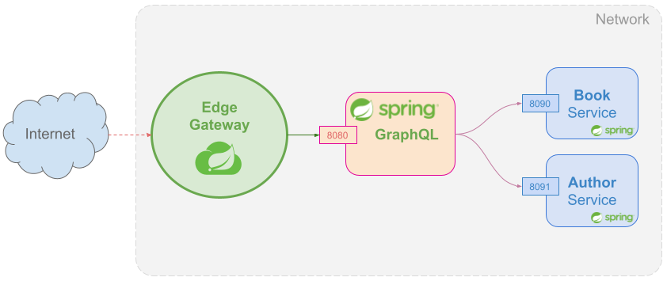
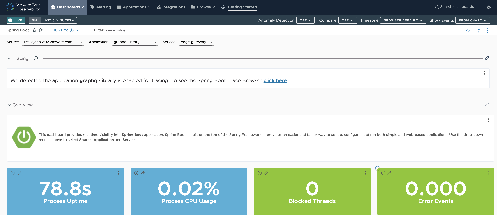
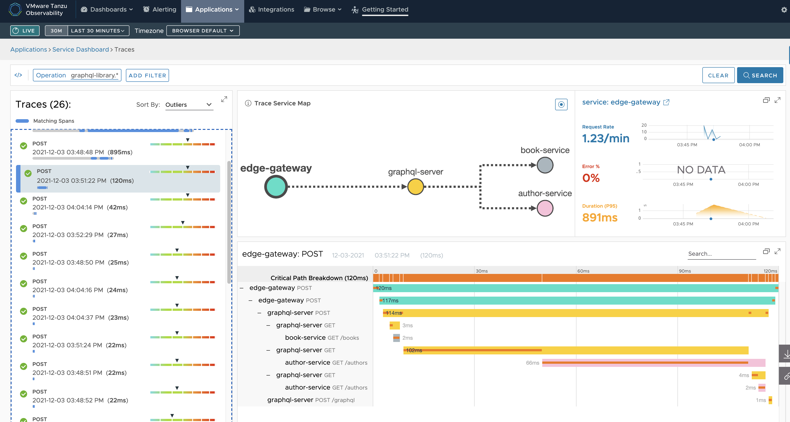

= Spring Cloud Gateway and GraphQL

> This post was co-authored with XXX

https://spring.io/projects/spring-graphql[Spring GraphQL] is a brand-new project that combines all the greatness of Spring with GraphQL.

However, GraphQL comes with a set of problems that can’t be easily solved, for example,  authentication, rate limiting, and observability.

Spring Cloud Gateway can be the perfect partner to your GraphQL applications since it can be easily customized to solve some of the problems GraphQL has.

We are going to see a full example where we extend a set of applications to expose a graph and add Spring Cloud Gateway on top to solve some of the problems.

== Introduction to GraphQL

GraphQL is an Open Source data query and manipulation language for APIs and a runtime for fulfilling queries with existing data based on a graph structure that simplifies how the consumer asks and receives the data it wants from a single endpoint.

Some benefits are a reduction of useless traffic with unnecessary data, eliminating classic over-fetching, and having a single endpoint where to locate data, it also provides static validation based on the schema that provides feedback to the developer without relying on runtime checks.

== Problems with GraphQL

=== Authentication

Authentication is the process of determining whether someone or something is, unlike Authorization whose goal is to give someone or something permissions.

If you don’t protect them with minimal authentication, someone could use your services with malicious intentions.
GraphQL server doesn't provide a built-in option to enable authentication, leaving your data exposed to any attacker.

=== Rate Limiting

GraphQL allows you to write a server implementation where every field has an independent way for resolving that value. However, without additional consideration, a naive implementation could repeatedly load data from many sources.

This is solved by a batching technique, where multiple requests for data are collected over a short period of time and then gathered into a single request to an underlying database or microservice but there is still a problem, even if we apply this pattern very well, authenticated calls must introduce a limit for the number of attempts.

=== Observability

Since GraphQL fetches and aggregates data from different sources, complex views can trigger
multiple calls to different systems, making it very easy to send a non-performing request that will do a whole graph traversal and, which can impact heavily your application performance.
Because of this, understanding how well your requests are performing becomes more important than ever.

Having data on how well a request is performing can help us identify optimization points and where should and how should we cache our queries.

The data you have available will depend on the technology you are using to implement your server and on how well you configure it.

== How Spring Cloud Gateway helps

We are going to show a scenario[https://github.com/Albertoimpl/spring-cloud-gateway-graphql] where we have two REST services that get exposed through a Spring GraphQL server and an instance of Spring Cloud Gateway to help solve the problems mentioned above.

=== Authentication

A Spring Cloud Gateway instance can be configured as an edge gateway providing the first control to the GraphQL server through Authentication.

In order to get that control in the Spring Cloud Gateway instance, the next dependency was included:

implementation 'org.springframework.boot:spring-boot-starter-security'

Spring Security will be applied to the Spring Cloud Gateway instance using the default configuration. For this project, we have added a WebFluxSecurity configuration that will enable basic authentication, and it will disable CORS and CSRF to simplify the demo.

A default user "alice" with password "test"  was defined to help demonstrate the end-to-end project, and we do not advise any real production environment to follow this approach.

After starting the Spring Cloud Gateway instance, all the requests will be protected with basic authentication and any non-authenticated request will be denied by Spring Cloud Gateway.

[source,bash]
----
curl -v http://localhost:8081/library -H'Content-Type: application/json' --data-binary '{"query": "{ books { isbn title }}"}'

< HTTP/1.1 401 Unauthorized
< WWW-Authenticate: Basic realm="Realm"

----

=== Rate Limiting

The best place to introduce a rate limit is in your API gateway.

We are going to add a dependency to redis in order to benefit from the already existing RequestRateLimiter that uses the canonical algorithm for rate limiting of a token bucket.

[source,groovy]
----
// Rate Limit
implementation "org.springframework.boot:spring-boot-starter-data-redis-reactive"
----

In that filter, we can customize values, such as, the burst capacity, which is the token bucket maximum capacity, or in other words, how many requests are allowed per second, and the replenish rate, which is how many tokens are added to the bucket every second.

[source,yaml]
----
  filters:
    - RewritePath=/library, /graphql
    - name: RequestRateLimiter
      args:
        redis-rate-limiter.replenishRate: 1
        redis-rate-limiter.burstCapacity: 1
----

We are going to set both of them to 1 in this example, so we can have a steady rate of one request per second.

[source,bash]
----
curl -X POST \
-H "Content-Type: application/json" \
-H "Authorization: Basic YWxpY2U6dGVzdA==" \
-d '{"query": "{books { title authors {firstName lastName } } }"}' \
http://localhost:8081/library -i

HTTP/1.1 200 OK
transfer-encoding: chunked
X-RateLimit-Remaining: 0
X-RateLimit-Requested-Tokens: 1
X-RateLimit-Burst-Capacity: 1
X-RateLimit-Replenish-Rate: 1
Content-Type: application/json
Date: Tue, 14 Dec 2021 11:22:17 GMT
----

And if we try again within the same second

[source,bash]
----
curl -X POST \
-H "Content-Type: application/json" \
-H "Authorization: Basic YWxpY2U6dGVzdA==" \
-d '{"query": "{books { title authors {firstName       lastName } } }"}' \
http://localhost:8081/library -i
HTTP/1.1 429 Too Many Requests
X-RateLimit-Remaining: 0
X-RateLimit-Requested-Tokens: 1
X-RateLimit-Burst-Capacity: 1
X-RateLimit-Replenish-Rate: 1
content-length: 0
----

=== Observability

The Spring portfolio has excellent observability support and by adding a couple of dependencies we can have metrics and tracing enabled in our project and automatically exported to an observability platform.

To help us understand how well our application is performing on each request we are going to add https://docs.wavefront.com/wavefront_springboot.html[Spring Boot Wavefront] for metrics and https://spring.io/projects/spring-cloud-sleuth[Spring Cloud Sleuth] for tracing.
If you want to learn more about them, I would recommend taking a look at https://spring.io/blog/2020/04/29/spring-tips-the-wavefront-observability-platform[this Spring tips episode].

After adding the dependencies to our project:
[source,groovy]
----
// Metrics
implementation "com.wavefront:wavefront-spring-boot-starter"
// Tracing
implementation 'org.springframework.cloud:spring-cloud-starter-sleuth'
----

If we restart our applications we see that wavefront automatically created a URL for us:

[source,log]
----
> Task :edge-gateway:bootRun

  .   ____          _            __ _ _
 /\\ / ___'_ __ _ _(_)_ __  __ _ \ \ \ \
( ( )\___ | '_ | '_| | '_ \/ _` | \ \ \ \
 \\/  ___)| |_)| | | | | || (_| |  ) ) ) )
  '  |____| .__|_| |_|_| |_\__, | / / / /
 =========|_|==============|___/=/_/_/_/
 :: Spring Boot ::                (v2.6.1)

2021-12-03 15:52:11.662  INFO [,,] 49868 --- [           main] e.s.SpringCloudGatewayGraphqlApplication : Starting SpringCloudGatewayGraphqlApplication using Java 11.0.9.1 on rcallejario-a02.vmware.com with PID 49868 (/Users/rcallejarios/workspace/spring-cloud-gateway-graphql/edge-gateway/build/classes/java/main started by rcallejarios in /Users/rcallejarios/workspace/spring-cloud-gateway-graphql/edge-gateway)
2021-12-03 15:52:11.663  INFO [,,] 49868 --- [           main] e.s.SpringCloudGatewayGraphqlApplication : No active profile set, falling back to default profiles: default
2021-12-03 15:52:12.808  INFO [,,] 49868 --- [           main] o.s.cloud.context.scope.GenericScope     : BeanFactory id=d7ad34d1-80f7-3ccf-9f24-f4bd40c9e6ed
2021-12-03 15:52:13.853  INFO [,,] 49868 --- [           main] o.s.c.g.r.RouteDefinitionRouteLocator    : Loaded RoutePredicateFactory [After]
2021-12-03 15:52:13.853  INFO [,,] 49868 --- [           main] o.s.c.g.r.RouteDefinitionRouteLocator    : Loaded RoutePredicateFactory [Before]
2021-12-03 15:52:13.853  INFO [,,] 49868 --- [           main] o.s.c.g.r.RouteDefinitionRouteLocator    : Loaded RoutePredicateFactory [Between]
2021-12-03 15:52:13.853  INFO [,,] 49868 --- [           main] o.s.c.g.r.RouteDefinitionRouteLocator    : Loaded RoutePredicateFactory [Cookie]
2021-12-03 15:52:13.853  INFO [,,] 49868 --- [           main] o.s.c.g.r.RouteDefinitionRouteLocator    : Loaded RoutePredicateFactory [Header]
2021-12-03 15:52:13.853  INFO [,,] 49868 --- [           main] o.s.c.g.r.RouteDefinitionRouteLocator    : Loaded RoutePredicateFactory [Host]
2021-12-03 15:52:13.853  INFO [,,] 49868 --- [           main] o.s.c.g.r.RouteDefinitionRouteLocator    : Loaded RoutePredicateFactory [Method]
2021-12-03 15:52:13.853  INFO [,,] 49868 --- [           main] o.s.c.g.r.RouteDefinitionRouteLocator    : Loaded RoutePredicateFactory [Path]
2021-12-03 15:52:13.853  INFO [,,] 49868 --- [           main] o.s.c.g.r.RouteDefinitionRouteLocator    : Loaded RoutePredicateFactory [Query]
2021-12-03 15:52:13.854  INFO [,,] 49868 --- [           main] o.s.c.g.r.RouteDefinitionRouteLocator    : Loaded RoutePredicateFactory [ReadBody]
2021-12-03 15:52:13.854  INFO [,,] 49868 --- [           main] o.s.c.g.r.RouteDefinitionRouteLocator    : Loaded RoutePredicateFactory [RemoteAddr]
2021-12-03 15:52:13.854  INFO [,,] 49868 --- [           main] o.s.c.g.r.RouteDefinitionRouteLocator    : Loaded RoutePredicateFactory [Weight]
2021-12-03 15:52:13.854  INFO [,,] 49868 --- [           main] o.s.c.g.r.RouteDefinitionRouteLocator    : Loaded RoutePredicateFactory [CloudFoundryRouteService]
2021-12-03 15:52:13.932  INFO [,,] 49868 --- [           main] i.m.c.instrument.push.PushMeterRegistry  : publishing metrics for WavefrontMeterRegistry every 1m
2021-12-03 15:52:14.262  INFO [,,] 49868 --- [           main] o.s.b.a.e.web.EndpointLinksResolver      : Exposing 1 endpoint(s) beneath base path '/actuator'
2021-12-03 15:52:14.682  INFO [,,] 49868 --- [           main] o.s.b.web.embedded.netty.NettyWebServer  : Netty started on port 8081
2021-12-03 15:52:14.755  INFO [,,] 49868 --- [           main] e.s.SpringCloudGatewayGraphqlApplication : Started SpringCloudGatewayGraphqlApplication in 4.538 seconds (JVM running for 4.905)

Your existing Wavefront account information has been restored from disk.

To share this account, make sure the following is added to your configuration:

        management.metrics.export.wavefront.api-token=12345678-026e-4355-9086-2xg48cfc1234
management.metrics.export.wavefront.uri=https://wavefront.surf

Connect to your Wavefront dashboard using this one-time use link:
https://wavefront.surf/us/tLcTcTPxcD
----

If we follow the link we can see a very detailed dashboard for Spring Boot applications and, on top, a link that states that traces were detected.

If we follow that link we can see a nice view of the applications that are connected and how long did it take per request.

By adding the dependencies to the services, we can now exactly see how long does it take for each query to be executed, making it very easy to identify optimization points.

== Getting started

The full project can be found in https://github.com/Albertoimpl/spring-cloud-gateway-graphql

And to get started with it, we can run the following gradle command

[source,bash]
----
./gradlew bootRun --parallel
----

Note: `--parallel` is needed for running a multi-gradle spring boot project. Alternatively, the projects author-service, book-service, graphql-server, and edge-gateway can be run individually running the command in each project folder.

After a few seconds you will have locally the following projects running:
some time to get all those projects running in your local machine:

* GraphQL Server on port 8080 with GraphQL endpoint: http://localhost:8080/graphql accepting POST requests

* Authors REST Service on port 8091: http://localhost:8091/authors

* Books REST Service on port 8090: http://localhost:8090/books

* Edge Spring Cloud Gateway on port 8081
Redirecting route http://localhost:8080/library to GraphQL endpoint
Actuator enabled on http://localhost:8081/actuator

It is important to know that in a production environment you only want to expose the Spring Cloud Gateway, which is acting as an edge gateway, and it will protect the GraphQL API. If you run the projects locally using gradle, all the endpoints can be reached.

On the other hand, GraphQL introspection and GraphiQL client have been disabled using the next Spring Boot GraphQL properties `graphql.tools.introspection-enabled: false` and  `graphql.graphiql.enabled: false`.

=== GraphQL queries

The next queries can be requested to the `http://localhost:8080/library` Spring Cloud Gateway route.

==== Getting all the authors

[source,bash]
----
curl -v http://localhost:8081/library \
-H'Content-Type: application/json' \
-H'Authorization: Basic YWxpY2U6dGVzdA==' \
--data-binary '{"query": "{ authors { firstName lastName picture email phone } }"}'
----

[source,bash]
----
{
  "data": {
    "authors": [
      {
        "firstName": "W. Frank",
        "lastName": "Ableson",
        "picture": "picture",
        "email": "email",
        "phone": "phone"
      },
      {
        "firstName": "Charlie",
        "lastName": "Collins",
        "picture": "picture",
        "email": "email",
        "phone": "phone"
      },
...
----

==== Getting all the authors' names

[source,bash]
----
curl -v http://localhost:8081/library \
-H'Content-Type: application/json' \
-H'Authorization: Basic YWxpY2U6dGVzdA==' \
--data-binary '{"query": "{ books { isbn title pageCount authors { firstName lastName picture email phone } } }"}'
----

[source,bash]
----
{
  "data": {
    "books": [
      {
        "isbn": "1933988673",
        "title": "Unlocking Android",
        "pageCount": 416,
        "authors": [
          {
            "firstName": "W. Frank",
            "lastName": "Ableson"
          },
          {
            "firstName": "Charlie",
            "lastName": "Collins"
          },
          {
            "firstName": "Robi",
            "lastName": "Sen"
          }
        ]
      },
...
----

==== Getting all the books without authors

[source,bash]
----
curl -v http://localhost:8081/library \
-H'Content-Type: application/json' \
-H'Authorization: Basic YWxpY2U6dGVzdA==' \
--data-binary '{"query": "{ books { isbn title pageCount }}"}'
----

[source,bash]
----
{
  "data": {
    "books": [
      {
        "isbn": "1933988673",
        "title": "Unlocking Android",
        "pageCount": 416
      },
      {
        "isbn": "1935182722",
        "title": "Android in Action, Second Edition",
        "pageCount": 592
      },
...
----

== Next Steps

In this post, we’ve looked at a few examples of how to solve some of the main problems GraphQL has and how they can be solved using Spring Cloud Gateway.
We would love to know what other usages you’ve found to be helpful in your experiences.
